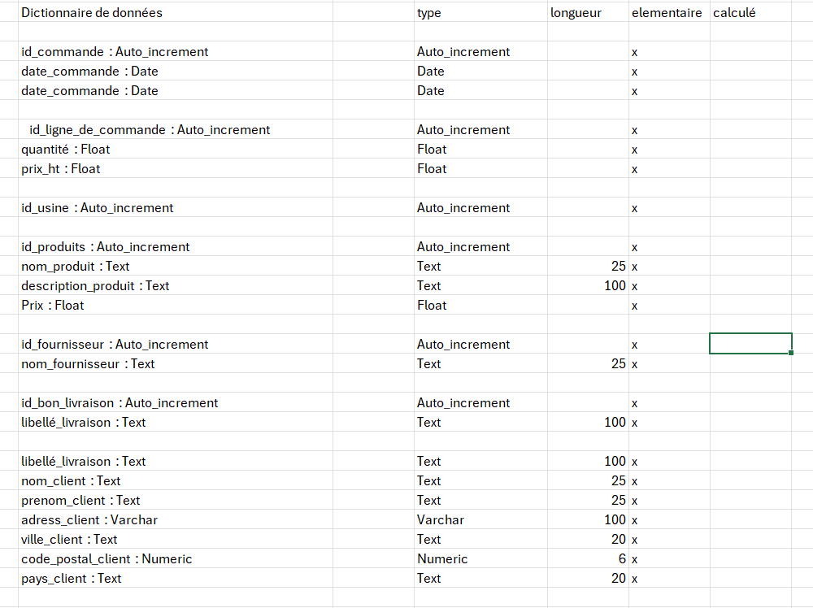
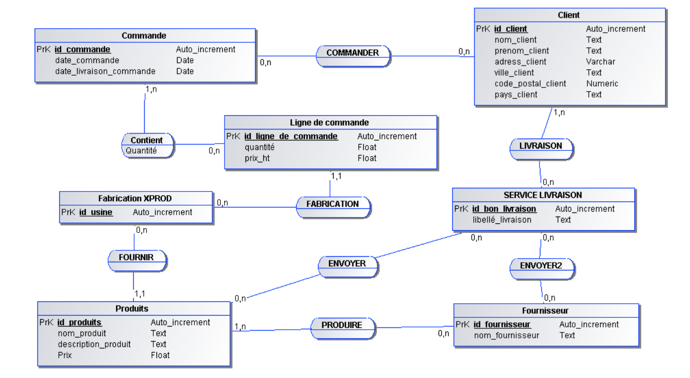
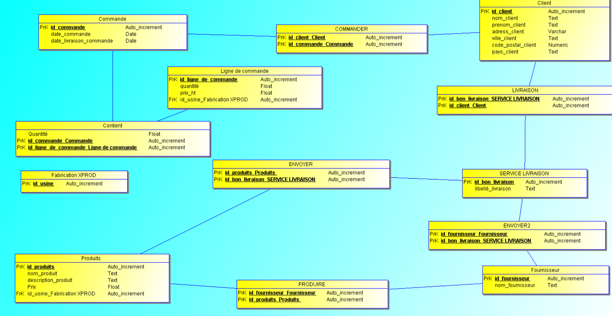

 # Examen pratique 1 👨‍🎓

# Sujet

L’entreprise `XProd` fabrique et commercialise divers produits. Ils sont identifiés par une référence propre à XProd et on enregistre une désignation (libellé court), un descriptif (libellé long) et un prix de vente catalogue unitaire hors taxes.

Dans la base de données, elle gère deux types de produits :
1. `Produits fabriqués` : Pour ces produits, on enregistre le nombre moyen d’heures de main d’œuvre nécessaires à leur fabrication.
2. `Produits approvisionnés` : Ces produits ne sont pas fabriqués par XProd, mais achetés à un ou plusieurs fournisseurs à un prix d’achat unitaire moyen.

Pour ne pas dépendre d’un fournisseur spécifique, enregistré par sa raison sociale, adresse, etc., l’entreprise a établi une liste de fournisseurs capables de livrer chaque produit approvisionné. Pour un même produit, chaque fournisseur peut avoir sa propre référence et un prix différent.

Lorsque XProd passe une commande à une certaine date à un fournisseur, elle essaie de grouper plusieurs lignes de commande : une par produit dans une certaine quantité avec sa date de livraison prévue, afin de réduire les frais de livraison de la commande et essayer de négocier un prix d’achat unitaire inférieur au prix catalogue du fournisseur.

## Travail à faire

- Créer le dictionnaire de données.
- Créer le Modèle Conceptuel des Données (MCD).
-Concevoir le Modèle Logique des Données (MLD).
- Concevoir le Modèle Physique des Données (MPD).


### Pour commencer voici mon `dictionnaire de données`

>Chaque données est classée par rapport a chaque entité avec son type, sa longueur, et est ce qu'il est élémentaire ou alors calculé (dans certains cas).




### Ensuite voici mon `Modèle Conceptuel des Données`




### Voici le `Modèle Logique des Données` :



### La relation (MLRD): 

```r
Produits  (  #id_produits,   nom_produit,   description_produit,   Prix,   id_usine_Fabrication XPROD  )

Commande (  #id_commande,   date_commande,   date_livraison_commande  )

Client (  #id_client,   nom_client,   prenom_client,   adress_client,   ville_client,   code_postal_client,   pays_client  )

Fournisseur (  #id_fournisseur,   nom_fournisseur  )

Ligne de commande (  #id_ligne_de_commande,   quantité,   prix_ht,   id_usine_Fabrication XPROD  )

Fabrication XPROD (  #id_usine  )

SERVICE LIVRAISON (  #id_bon_livraison,   libellé_livraison  )

Contient ( Quantité,    #id_commande_Commande,    #id_ligne_de_commande_Ligne de commande  )

PRODUIRE (  #id_fournisseur_Fournisseur,    #id_produits_Produits   )

COMMANDER (  #id_client_Client,    #id_commande_Commande  )

ENVOYER (  #id_produits_Produits ,    #id_bon_livraison_SERVICE LIVRAISON  )

LIVRAISON (  #id_bon_livraison_SERVICE LIVRAISON,    #id_client_Client  )

ENVOYER2 (  #id_fournisseur_Fournisseur,    #id_bon_livraison_SERVICE LIVRAISON  )
```

### Et pour finir voici le modele physique qui permet d'etre importé dans un GDBDD `(Gestionnaire de base de donnée)` comme **Mysql** que j'utilise fournis par JMERISE. (il ne peux pas être executé 😂)

```sql
#Ma base de données : 

DROP TABLE IF EXISTS Produits ;
CREATE TABLE Produits (
        id_produits     Auto_increment (25),
        nom_produit     Text (25),
        description_produit     Text (25),
        Prix     Float (25),
        id_usine_Fabrication XPROD     Auto_increment (25),
        PRIMARY KEY (id_produits)
)ENGINE=InnoDB;


DROP TABLE IF EXISTS Commande;
CREATE TABLE Commande(
        id_commande     Auto_increment (25),
        date_commande     Date (25),
        date_livraison_commande     Date (25),
        PRIMARY KEY (id_commande)
)ENGINE=InnoDB;


DROP TABLE IF EXISTS Client;
CREATE TABLE Client(
        id_client     Auto_increment (25),
        nom_client     Text (25),
        prenom_client     Text (25),
        adress_client     Varchar (100),
        ville_client     Text (25),
        code_postal_client     Numeric (6),
        pays_client     Text (25),
        PRIMARY KEY (id_client)
)ENGINE=InnoDB;


DROP TABLE IF EXISTS Fournisseur;
CREATE TABLE Fournisseur(
        id_fournisseur     Auto_increment (25),
        nom_fournisseur     Text (25),
        PRIMARY KEY (id_fournisseur)
)ENGINE=InnoDB;


DROP TABLE IF EXISTS Ligne de commande;
CREATE TABLE Ligne de commande(
        id_ligne_de_commande     Auto_increment (25),
        quantité     Float (25,2),
        prix_ht     Float (25),
        id_usine_Fabrication XPROD     Auto_increment (25),
        PRIMARY KEY (id_ligne_de_commande)
)ENGINE=InnoDB;


DROP TABLE IF EXISTS Fabrication XPROD;
CREATE TABLE Fabrication XPROD(
        id_usine     Auto_increment (25),
        PRIMARY KEY (id_usine)
)ENGINE=InnoDB;


DROP TABLE IF EXISTS SERVICE LIVRAISON;
CREATE TABLE SERVICE LIVRAISON(
        id_bon_livraison     Auto_increment (25),
        libellé_livraison     Text (100),
        PRIMARY KEY (id_bon_livraison)
)ENGINE=InnoDB;


DROP TABLE IF EXISTS Contient;
CREATE TABLE Contient(
        Quantité     Float (25),
        id_commande_Commande     Auto_increment (25),
        id_ligne_de_commande_Ligne de commande     Auto_increment (25),
        PRIMARY KEY (id_commande_Commande,id_ligne_de_commande_Ligne de commande)
)ENGINE=InnoDB;


DROP TABLE IF EXISTS PRODUIRE;
CREATE TABLE PRODUIRE(
        id_fournisseur_Fournisseur     Auto_increment (25),
        id_produits_Produits      Auto_increment (25),
        PRIMARY KEY (id_fournisseur_Fournisseur,id_produits_Produits )
)ENGINE=InnoDB;


DROP TABLE IF EXISTS COMMANDER;
CREATE TABLE COMMANDER(
        id_client_Client     Auto_increment (25),
        id_commande_Commande     Auto_increment (25),
        PRIMARY KEY (id_client_Client,id_commande_Commande)
)ENGINE=InnoDB;


DROP TABLE IF EXISTS ENVOYER;
CREATE TABLE ENVOYER(
        id_produits_Produits      Auto_increment (25),
        id_bon_livraison_SERVICE LIVRAISON     Auto_increment (25),
        PRIMARY KEY (id_produits_Produits ,id_bon_livraison_SERVICE LIVRAISON)
)ENGINE=InnoDB;


DROP TABLE IF EXISTS LIVRAISON;
CREATE TABLE LIVRAISON(
        id_bon_livraison_SERVICE LIVRAISON     Auto_increment (25),
        id_client_Client     Auto_increment (25),
        PRIMARY KEY (id_bon_livraison_SERVICE LIVRAISON,id_client_Client)
)ENGINE=InnoDB;


DROP TABLE IF EXISTS ENVOYER2;
CREATE TABLE ENVOYER2(
        id_fournisseur_Fournisseur     Auto_increment (25),
        id_bon_livraison_SERVICE LIVRAISON     Auto_increment (25),
        PRIMARY KEY (id_fournisseur_Fournisseur,id_bon_livraison_SERVICE LIVRAISON)
)ENGINE=InnoDB;


ALTER TABLE Produits  ADD CONSTRAINT FK_Produits _id_usine_Fabrication XPROD FOREIGN KEY (id_usine_Fabrication XPROD) REFERENCES Fabrication XPROD(id_usine)
ALTER TABLE Ligne de commande ADD CONSTRAINT FK_Ligne de commande_id_usine_Fabrication XPROD FOREIGN KEY (id_usine_Fabrication XPROD) REFERENCES Fabrication XPROD(id_usine)
ALTER TABLE Contient ADD CONSTRAINT FK_Contient_id_commande_Commande FOREIGN KEY (id_commande_Commande) REFERENCES Commande(id_commande)
ALTER TABLE Contient ADD CONSTRAINT FK_Contient_id_ligne_de_commande_Ligne de commande FOREIGN KEY (id_ligne_de_commande_Ligne de commande) REFERENCES Ligne de commande(id_ligne_de_commande)
ALTER TABLE PRODUIRE ADD CONSTRAINT FK_PRODUIRE_id_fournisseur_Fournisseur FOREIGN KEY (id_fournisseur_Fournisseur) REFERENCES Fournisseur(id_fournisseur)
ALTER TABLE PRODUIRE ADD CONSTRAINT FK_PRODUIRE_id_produits_Produits  FOREIGN KEY (id_produits_Produits ) REFERENCES Produits (id_produits)
ALTER TABLE COMMANDER ADD CONSTRAINT FK_COMMANDER_id_client_Client FOREIGN KEY (id_client_Client) REFERENCES Client(id_client)
ALTER TABLE COMMANDER ADD CONSTRAINT FK_COMMANDER_id_commande_Commande FOREIGN KEY (id_commande_Commande) REFERENCES Commande(id_commande)
ALTER TABLE ENVOYER ADD CONSTRAINT FK_ENVOYER_id_produits_Produits  FOREIGN KEY (id_produits_Produits ) REFERENCES Produits (id_produits)
ALTER TABLE ENVOYER ADD CONSTRAINT FK_ENVOYER_id_bon_livraison_SERVICE LIVRAISON FOREIGN KEY (id_bon_livraison_SERVICE LIVRAISON) REFERENCES SERVICE LIVRAISON(id_bon_livraison)
ALTER TABLE LIVRAISON ADD CONSTRAINT FK_LIVRAISON_id_bon_livraison_SERVICE LIVRAISON FOREIGN KEY (id_bon_livraison_SERVICE LIVRAISON) REFERENCES SERVICE LIVRAISON(id_bon_livraison)
ALTER TABLE LIVRAISON ADD CONSTRAINT FK_LIVRAISON_id_client_Client FOREIGN KEY (id_client_Client) REFERENCES Client(id_client)
ALTER TABLE ENVOYER2 ADD CONSTRAINT FK_ENVOYER2_id_fournisseur_Fournisseur FOREIGN KEY (id_fournisseur_Fournisseur) REFERENCES Fournisseur(id_fournisseur)
ALTER TABLE ENVOYER2 ADD CONSTRAINT FK_ENVOYER2_id_bon_livraison_SERVICE LIVRAISON FOREIGN KEY (id_bon_livraison_SERVICE LIVRAISON) REFERENCES SERVICE LIVRAISON(id_bon_livraison)

```

# ⛹️‍♂️ Examen pratique 2 ⛹️‍♂️

### Ci-dessous le dictionnaire de données 


### Puis le MCD


### Puis le MLD


### Le modele  relationnel (MLRD)

```r
Sportifs (  #id_sportif,   nom_sportif,   prénom_sportif,   adresse_sportif,   ville_sportif,   code_postal_sportif,   pays_sportif,   numero_tel_sportif,   fax_sportif,   email_sportif,   numero_license_sportif,   nom_club_sportif,   numero_certificat_medical_sportif,   date_certificat_medical_sportif  )

Compétitions (  #id_competition,   libellé_competition,   date_competition,   nombre_epreuves  )

Epreuves (  #id_epreuves,   nom_epreuve,   ville_epreuve,   distance_epreuve,   id_type_Type  )

Inscription compétition (  #numero_dossard_sportif,   id_competition_Compétitions  )

Type (  #id_type,   libellé_type_epreuves,   distance_type_epreuves,   cond_real_type_epreuves  )

Attribuer (  #id_sportif_Sportifs,    #numero_dossard_sportif_Inscription compétition  )

Contenir (  #id_competition_Compétitions,    #id_epreuves_Epreuves  )
```
 
 