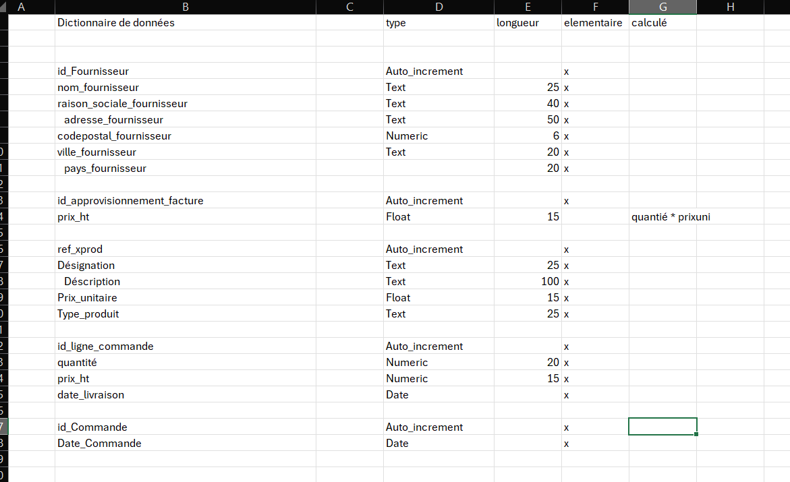
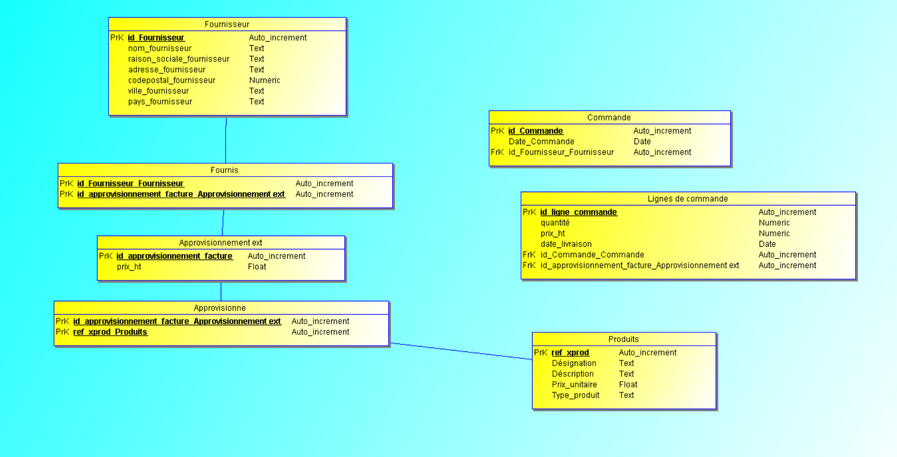
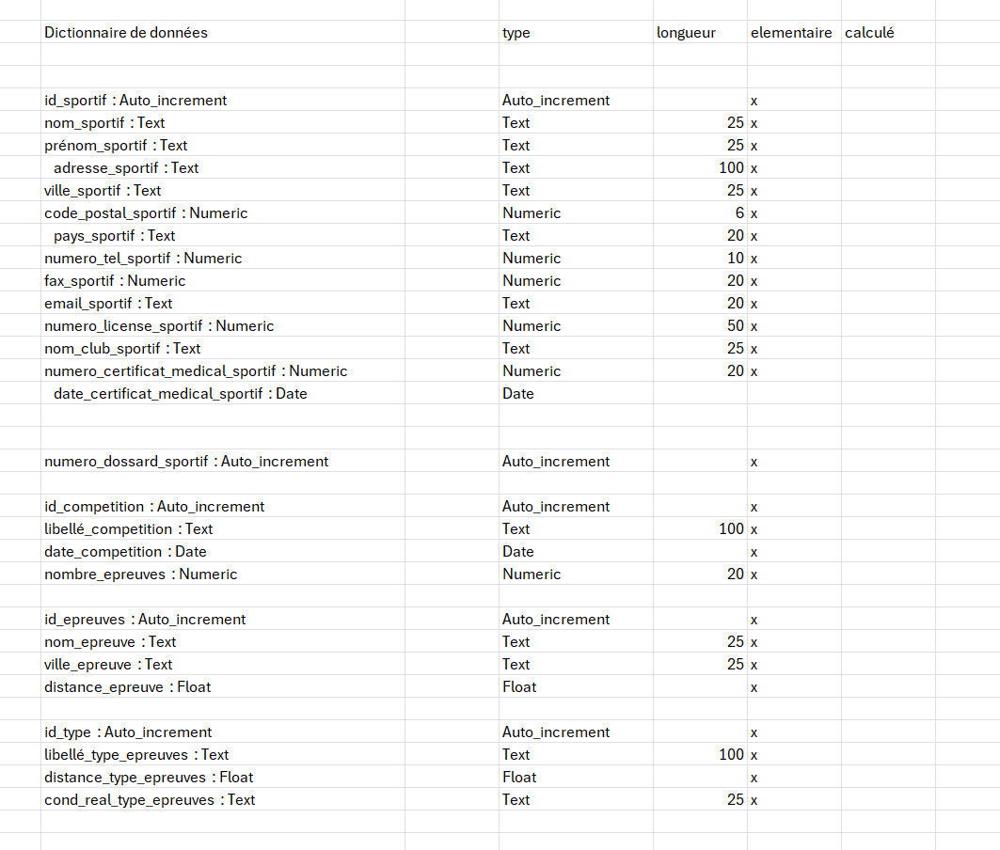
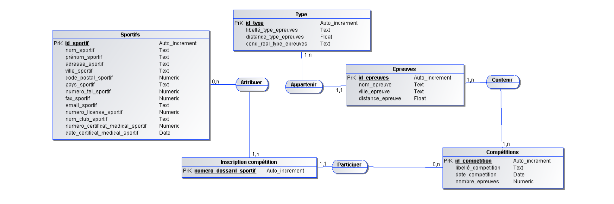
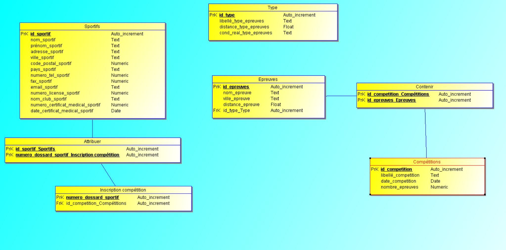

 # Examen pratique 1


Dictionaire de donnée 




 ## MCD


Voici le MLD 
: 



relationel : 

```r
Produits (  #ref_xprod,   Désignation,   Déscription,   Prix_unitaire,   Type_produit  )

Fournisseur (  #id_Fournisseur,   nom_fournisseur,   raison_sociale_fournisseur,   adresse_fournisseur,   codepostal_fournisseur,   ville_fournisseur,   pays_fournisseur  )

Commande (  #id_Commande,   Date_Commande,   id_Fournisseur_Fournisseur  )

Approvisionnement ext (  #id_approvisionnement_facture,   prix_ht  )

Lignes de commande (  #id_ligne_commande,   quantité,   prix_ht,   date_livraison,   id_Commande_Commande,   id_approvisionnement_facture_Approvisionnement ext  )

Fournis (  #id_Fournisseur_Fournisseur,    #id_approvisionnement_facture_Approvisionnement ext  )

Approvisionne  (  #id_approvisionnement_facture_Approvisionnement ext,    #ref_xprod_Produits  )
```
Modele physique 


```sql
DROP TABLE IF EXISTS Produits;
CREATE TABLE Produits (
    ref_xprod INT AUTO_INCREMENT,
    Désignation TEXT,
    Déscription TEXT,
    Prix_unitaire FLOAT,
    Type_produit TEXT,
    PRIMARY KEY (ref_xprod)
) ENGINE=InnoDB;

DROP TABLE IF EXISTS Fournisseur;
CREATE TABLE Fournisseur (
    id_Fournisseur INT AUTO_INCREMENT,
    nom_fournisseur TEXT,
    raison_sociale_fournisseur TEXT,
    adresse_fournisseur TEXT,
    codepostal_fournisseur INT,
    ville_fournisseur TEXT,
    pays_fournisseur TEXT,
    PRIMARY KEY (id_Fournisseur)
) ENGINE=InnoDB;

DROP TABLE IF EXISTS Commande;
CREATE TABLE Commande (
    id_Commande INT AUTO_INCREMENT,
    Date_Commande DATE,
    id_Fournisseur_Fournisseur INT,
    PRIMARY KEY (id_Commande),
    FOREIGN KEY (id_Fournisseur_Fournisseur) REFERENCES Fournisseur(id_Fournisseur)
) ENGINE=InnoDB;

DROP TABLE IF EXISTS `Approvisionnement ext`;
CREATE TABLE `Approvisionnement ext` (
    id_approvisionnement_facture INT AUTO_INCREMENT,
    prix_ht FLOAT,
    PRIMARY KEY (id_approvisionnement_facture)
) ENGINE=InnoDB;

DROP TABLE IF EXISTS `Lignes de commande`;
CREATE TABLE `Lignes de commande` (
    id_ligne_commande INT AUTO_INCREMENT,
    quantité INT,
    prix_ht FLOAT,
    date_livraison DATE,
    id_Commande_Commande INT,
    id_approvisionnement_facture_Approvisionnement_ext INT,
    PRIMARY KEY (id_ligne_commande),
    FOREIGN KEY (id_Commande_Commande) REFERENCES Commande(id_Commande),
    FOREIGN KEY (id_approvisionnement_facture_Approvisionnement_ext) REFERENCES `Approvisionnement ext`(id_approvisionnement_facture)
) ENGINE=InnoDB;

DROP TABLE IF EXISTS Fournis;
CREATE TABLE Fournis (
    id_Fournisseur_Fournisseur INT,
    id_approvisionnement_facture_Approvisionnement_ext INT,
    PRIMARY KEY (id_Fournisseur_Fournisseur, id_approvisionnement_facture_Approvisionnement_ext),
    FOREIGN KEY (id_Fournisseur_Fournisseur) REFERENCES Fournisseur(id_Fournisseur),
    FOREIGN KEY (id_approvisionnement_facture_Approvisionnement_ext) REFERENCES `Approvisionnement ext`(id_approvisionnement_facture)
) ENGINE=InnoDB;

DROP TABLE IF EXISTS Approvisionne;
CREATE TABLE Approvisionne (
    id_approvisionnement_facture_Approvisionnement_ext INT,
    ref_xprod_Produits INT,
    PRIMARY KEY (id_approvisionnement_facture_Approvisionnement_ext, ref_xprod_Produits),
    FOREIGN KEY (id_approvisionnement_facture_Approvisionnement_ext) REFERENCES `Approvisionnement ext`(id_approvisionnement_facture),
    FOREIGN KEY (ref_xprod_Produits) REFERENCES Produits(ref_xprod)
) ENGINE=InnoDB;
```

# Examen pratique 2

Dictionnaire de donnée 



Mcd



MLD



MLRD 

```r
Sportifs (  #id_sportif,   nom_sportif,   prénom_sportif,   adresse_sportif,   ville_sportif,   code_postal_sportif,   pays_sportif,   numero_tel_sportif,   fax_sportif,   email_sportif,   numero_license_sportif,   nom_club_sportif,   numero_certificat_medical_sportif,   date_certificat_medical_sportif  )

Compétitions (  #id_competition,   libellé_competition,   date_competition,   nombre_epreuves  )

Epreuves (  #id_epreuves,   nom_epreuve,   ville_epreuve,   distance_epreuve,   id_type_Type  )

Inscription compétition (  #numero_dossard_sportif,   id_competition_Compétitions  )

Type (  #id_type,   libellé_type_epreuves,   distance_type_epreuves,   cond_real_type_epreuves  )

Attribuer (  #id_sportif_Sportifs,    #numero_dossard_sportif_Inscription compétition  )

Contenir (  #id_competition_Compétitions,    #id_epreuves_Epreuves  )
```
